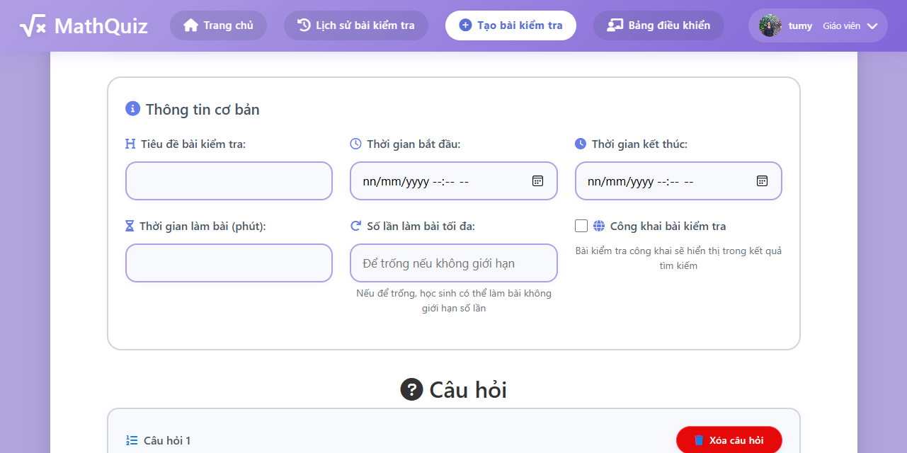
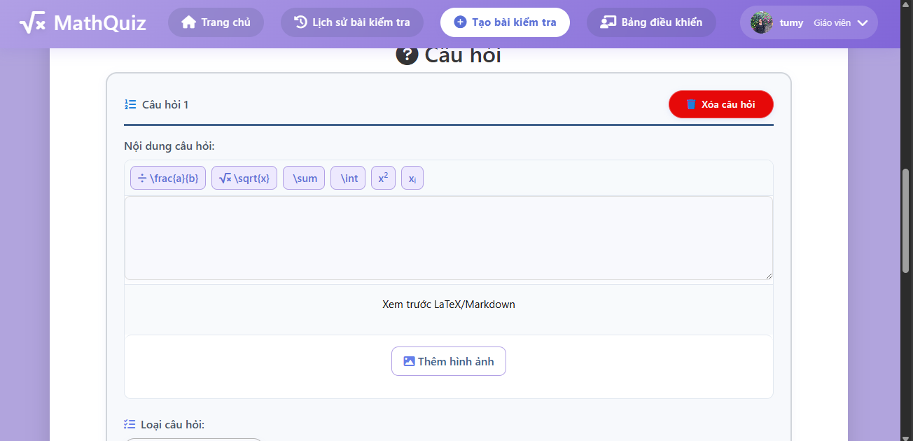

#   QUIZ APP
***MATHQUIZ - Ứng dụng tạo và làm bài kiểm tra toán học***


## 1. MÔ TẢ ĐỀ TÀI

### 1.1. Mô tả tổng quan

- **Ý tưởng thực hiện:**  
  Trong bối cảnh chuyển đổi số trong giáo dục, việc ứng dụng công nghệ vào dạy và học ngày càng trở nên cần thiết. Một trong những nhu cầu cấp thiết là xây dựng một nền tảng kiểm tra trực tuyến thân thiện, dễ sử dụng, đặc biệt hỗ trợ cho việc kiểm tra kiến thức các môn học có nhiều công thức như Toán học.  
  Từ thực tế đó, nhóm em đề xuất xây dựng một ứng dụng web có tên là Quiz App, cho phép giáo viên tạo đề kiểm tra, nhập các câu hỏi có chứa công thức toán (hỗ trợ LaTeX), và học sinh có thể làm bài trực tiếp trên giao diện đơn giản, dễ tiếp cận.  

- **Ứng dụng này hướng đến mục tiêu:** 
    + Hỗ trợ giáo viên dễ dàng tạo các đề trắc nghiệm/tự luận có hỗ trợ nhập công thức toán học dạng LaTex.  
    + Học sinh có thể làm bài mọi lúc mọi nơi, tiết kiệm thời gian và giấy mực.  
    + Tự động chấm điểm và lưu trữ kết quả.
- **Các vấn đề cần giải quyết:**
    + Giới hạn thời gian cho bài kiểm tra: thời gian bắt đầu,kết thúc và thời gian làm bài kiểm tra.
    + Thiết kế giao diện đa vai trò:  
        * Phân quyền người dùng gồm giáo viên (admin) và học sinh.  
        * Giáo viên được phép tạo câu hỏi, tạo bài kiểm tra, xem kết quả.  
        * Học sinh chỉ được phép làm bài kiểm tra và xem điểm số.
    + Hỗ trợ tích hợp LaTex vào phần tạo câu hỏi và câu trả lời.
- **Lý do chọn đề tài:**
    + Phù hợp với xu hướng giáo dục: sau dịch COVID-19, việc học online đang dần phổ biến trong hệ thống giáo dục bởi tính hữu ích, cùng với đó hình thức kiểm tra online cũng được áp dụng vào, chính vì thế những ứng dụng như Quiz rất thiết thực.
    + Nhiều giáo viên vẫn gặp khó khăn trong việc tạo đề online có công thức toán học.
    + Tính ứng dụng cao: Ứng dụng có thể mở rộng không chỉ cho môn Toán mà cả Lý, Hóa, và các môn trắc nghiệm khác.
    + Mong muốn giúp các giáo viên có thể tiết kiệm thời gian trong công việc, tự động hóa công việc chấm điểm.
      
### 1.2. Mục tiêu
[Viết các mục tiêu cụ thể của đề tài, những gì bạn muốn đạt được sau khi hoàn thành.]
- Mục tiêu 1: Giáo viên có thể tạo bài kiểm tra/Học sinh có thể làm bài kiểm tra và xem lại điểm số.
- Mục tiêu 2: Ứng dụng có thể tạo tự động câu hỏi và câu trả lời dựa vào file .csv(Có format) mà giáo viên đưa ra.
- Mục tiêu 3: Tích hợp nhập định dạng LaTex khi tạo câu hỏi và câu trả lời.
  
## 2. THÔNG TIN NHÓM

| Họ và tên               | Gmail                           |
|------------------------|----------------------------------|
| Lê Hà Tú My            | lehatmy@gmail.com                |
| Nguyễn Quang Mạnh      | nguyenquangmanh120304@gmail.com |
| Phạm Thị Ngọc Hương    | pvnhuong2405@gmail.com           |
| Nguyễn Thanh Tường Vy  | nvy2902@gmail.com                |

## 3. Hướng dẫn cài đặt hoặc sử dụng

- **Cách thức cài đặt:**   
  + Yêu cầu: Phiên bản `python` dưới **3.13** (khuyến khích sử dụng phiên bản 3.10, 3.11, 3.12)  
  + **Hướng dẫn cài đặt:**    
    **Kích hoạt môi trường ảo:**
    ```
    python -m venv venv
    venv/scripts/activate
    ```
    **Cài đặt thư viện:**
    ```
    pip install -r requirementss.txt
    ```
    **Chạy ứng dụng :**
    ```
    python app.py
    ```

* Triển khai ứng dụng : đóng gói bằng Docker và deploy ứng dụng lên Cloud Run
* Truy cập MathQuiz qua đường link: https://python-quiz-app-303799271660.asia-east1.run.app/ 

## 4. Link video: https://drive.google.com/file/d/13xmox09DEfdwN9OkpUQaw_I3IKfHlZw3/view?usp=sharing
## 5. Screenshots

### Giao diện trang chủ


#### Giao diện Đăng nhập/Đăng ký


#### Giao diện giáo viên – Tạo bài kiểm tra





#### Giao diện học sinh – Làm bài kiểm tra


#### Giao diện quản lý bài kiểm tra


#### Lịch sử các bài kiểm tra


© 2025 MathQuiz - Nền tảng kiểm tra toán học trực tuyến
